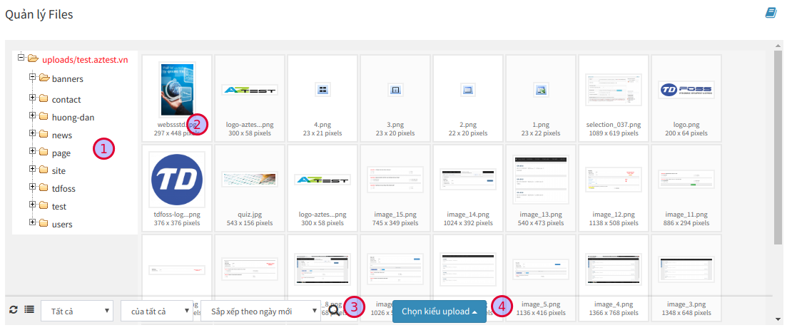
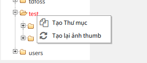
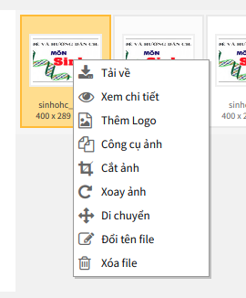
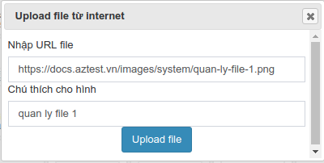
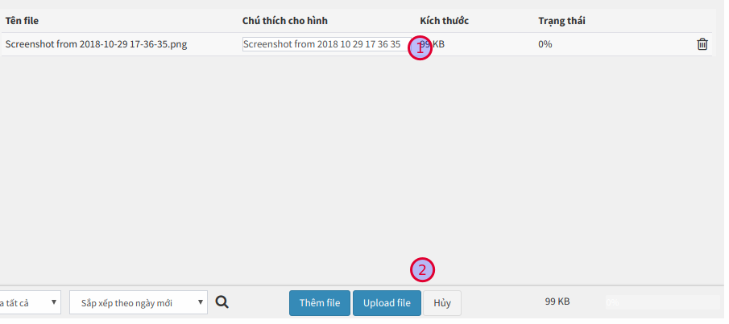

Khu vực **Quản lý File** giúp người quản trị quản lý (upload, sửa thông tin, xóa, tạo thư mục,...) các thư mục, tập tin được upload lên hệ thống.

Truy cập **Quản lý File** (Menu ngang)

Trên đây là giao diện quản lý file. Các khu vực quan trọng bạn cần biết:

- **Quản lý thư mục (1):** Tại khu vực này, bạn có thể truy cập đến thư mục. Danh sách thư mục ở đây sẽ bao gồm toàn bộ thư mục của các module khác. Click phải chuột vào tên thư mục, bạn sẽ thấy:

	- **Tạo thư mục:** Tạo thêm thư mục là thư mục con của thư mục đang được click
	- **Tạo lại ảnh thumb**

- **Quản lý File (2):** Khi click vào thư mục, danh sách file ở bảng bên phải sẽ hiển thị các file thuộc thư mục được chọn. Click phải chuột vào file, bạn sẽ thấy:

| Thông tin | Mô tả |
|-----------|-------|
| Tải về | Download file được chọn về máy |
| Xem chi tiết | Hiển thị thông tin chi tiết về file. Thông tin: tên file, kích thước, dung lượng, thời gian cập nhật,.... |
| Thêm logo | Xem [Cấu hình đóng dấu ảnh](/uploads/#cau-hinh-ong-dau-anh) |
| Công cụ ảnh | Sử dụng công cụ này để cắt hình ảnh về một kích thước nhỏ hơn cùng tỉ lệ |
| Cắt ảnh | Sử dụng công cụ này để chọn vùng ảnh cần cắt |
| Xoay ảnh | Sử dụng công cụ này để xoay hướng ảnh |
| Di chuyển | Sử dụng công cụ này để di chuyển ảnh đến một thư mục khác |
| Đổi tên file | Sử dụng công cụ này để đổi tên file |
| Xóa file | Sử dụng công cụ này để xóa file ra khỏi hệ thống |

- **Tìm kiếm file (3):** Bạn có thể dễ dàng lọc file theo các tiêu chí được cung cấp tại khu vực này
- **Tải lên một file mới (4):** Xem [Tải lên một file mới](/uploads/#tai-len-mot-file-moi)

### Tải lên một file mới

Tại khu vực 4, bạn click vào nút **Chọn kiểu upload**, khi đó sẽ có hai lựa chọn, tùy vào vị trí lưu file bạn cần chọn phương án phù hợp.

- **Upload từ internet:** Trường hợp này khi bạn có URL của một file được lưu trữ trực tuyến. Ví dụ: `https://docs.aztest.vn/images/uploads/quan-ly-file-1.png`. Nhập được dẫn này vào ô **Nhập URL file** sau đó nhấn **Upload file**, hệ thống sẽ tiến hành download file về máy chủ.

- **Upload từ máy tính:** Trường hợp file lưu tại máy tính, click **Upload từ máy tính**, sau đó chọn đến file cần upload. Có thể chọn nhiều file để upload cùng lúc. Sau khi chọn file, hệ thống sẽ hiện thị lại thông tin của file, bạn có thể điều chỉnh lại mô tả hình ảnh (1) hoặc xóa file khỏi danh sách tại giao diện này. Cuối cùng, click **Upload file (2)** để tiến hành upload file lên hệ thống.

### Cấu hình đóng dấu ảnh

Đây là một hình thức để bạn có thể in dấu bản quyền lên hình ảnh sau khi đưa lên website một cách tự động mà không cần dùng đến các công cụ ảnh khác để chỉnh sửa.

Để thiết lập, truy cập **Quản lý file / Cấu hình chèn logo** (Menu ngang)

Các thông tin cần quan tâm:

- **Tự động chèn Logo vào ảnh của các module**: Chọn các module sẽ áp dụng việc đóng dấu ảnh
- **Logo khi thêm vào hình ảnh**: Chọn hình ảnh sẽ được dùng để đóng dấu lên ảnh. Bạn nên thiết kế một ảnh có nền trong suốt (với định dạng png).
- **Vị trí của logo**: chọn ví trí hiển thị của ảnh được đóng dấu

Nhấn **Cập nhật** để lưu thay đổi. Quay trở lại hộp quản lý file, bạn có thể upload một hình ảnh (vào thư mục của module đã chọn ở trên) để xem kết quả.